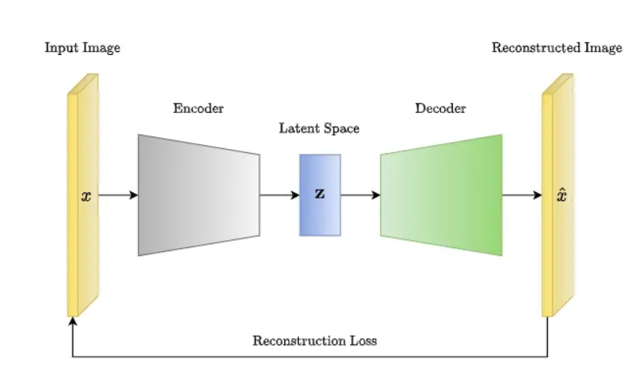

<h1 align="center">Generative AI</h1>

    

## 1. Apa itu Generative AI ?

    

Generative Artificial Intelligence atau yang biasa dikenal juga dengan istilah Generative AI merupakan sebuah teknologi yang memungkinkan pengguna untuk menghasilkan konten baru berdasarkan input yang diberikan. Input dan output yang diinginkan dapat berupa `teks`, `gambar`, `suara`, `video`, dan bentuk data lainnya.

## 2. Bagaimana Cara Generative AI Bekerja?
Generative AI menggunakan model `jaringan saraf` untuk mengidentifikasi pola dan struktur dalam data yang ada untuk menghasilkan konten baru dan asli. Untuk menghasilkan konten yang berkualitas diperlukan *train* data. Hal ini bertujuan untuk AI yang sedang dikembangkan dapat mempelajari data yang telah ada agar dapat menghasilkan konten yang berkualitas. Misalnya, dalam kasus GANs. Generator menciptakan gambar berdasarkan pola yang telah dipelajari dari data pelatihan. Konten yang dihasilkan tentunya tergantung dari *prompt* pengguna. Jika pengguna menginginkan hasil dalam bentuk artikel, maka hasil yang diberikan akan berbentuk artikel. Ada 3 hal penting untuk menyatakan bahwa Generative AI yang digunakan itu bekerja dengan baik di antaranya adalah kualitas, diversitas, dan kecepatan untuk menghasilkan konten dengan cepat.

## 3. Discriminative and Generative Model

    

### a. Discriminative Model

    

`Discriminative Model` adalah model yang mempelajari tentang batasan antar kelas dalam kumpulan data. Tujuan mdengan menggunakan model ini adalah untuk mengidentifikasi batas keputusan antar kelas. Model diskriminatif memisahkan kelas dalam kumpulan data dengan menggunakan probabilitas bersyarat, tidak membuat asumsi apa pun tentang poin data individual. Seperti pada gambar di bawah ini, apakah lukisan tersebut merupakan lukisan dari Van Gogh. Model diskriminatif digunakan untuk memprediksi label output berdasarkan sekumpulan fitur pada input.

### b. Generative Model

    

`Generative Model` adalah rancangan AI yang berpusat pada distribusi kelas dalam dataset. Algoritma pembelajaran mesin biasanya memodelkan distribusi titik data. Model generatif bergantung pada penemuan probabilitas bersama. Membuat poin di mana fitur input yang diberikan dan output/label yang diinginkan ada secara bersamaan. Terdapat 3 model yang umum digunakan pada Generative AI di antaranya adalah `Diffusion Model`, `Variational Autoencoders (VAEs)`, dan `Generative Adversarial Networks (GANs)`.

Pada diffusion model terdapat proses `difusi maju` dan `difusi mundur`. Kemudian pada Variational Autoencoders (VAEs) terdiri dari `encoder` dan `decoder` yang berfungsi untuk mengompres data menjadi variabel laten dan kemudian menghasilkan data baru. Lalu ada GANs terdiri dari dua neural network, yaitu `generator` dan `diskriminator`

#### b.1 Diffusion Model

    

`Diffusion Model` bekerja dengan cara menambahkan *noise* ke data pelatihan dan kemudian belajar bagaimana mengembalikan proses tersebut. Proses ini disebut sebagai "denoising" atau "reverse diffusion" dan digunakan untuk menghasilkan contoh baru yang mirip dengan data pelatihan.
#### b.2 Variational autoencoders (VAEs)

    

`Variational Autoencoders (VAEs)` bekerja dengan cara mengkomunikasikan data asli ke dalam representasi terkompresi yang disebut ruang laten, kemudian mengembalikan data ke aslinya dengan mengambil sampel dari distribusi laten.
#### b.3 Generative Adversarial Networks

    

`Generative Adversarial Networks` bekerja dengan mencoba membuat data semirip mungkin dengan data nyata. Mereka menggunakan teknik seperti Convolutional Neural Networks (CNN) untuk menghasilkan data baru. Kemudian model ini berusaha untuk membedakan antara data yang dihasilkan oleh model generasi dan data nyata. Mereka menggunakan teknik seperti `supervised learning` untuk membedakan antara data yang dihasilkan oleh model generasi dan data nyata.

    

## Referensi
- [GANs — Generative Adversarial Networks](https://medium.com/devtechie/gans-generative-adversarial-networks-ced97548125e)

<h2 align="center">Keperluan Magang</h2>

- [PPT Generative AI](https://www.canva.com/design/DAGHEDurLkE/nxlfouUEhaeGu-DLrsyUuQ/edit?utm_content=DAGHEDurLkE&utm_campaign=designshare&utm_medium=link2&utm_source=sharebutton)
- [Code](https://colab.research.google.com/drive/1noTuQZB-aMlq6pz-sIdi-mng7aslaPnI?usp=sharing)
